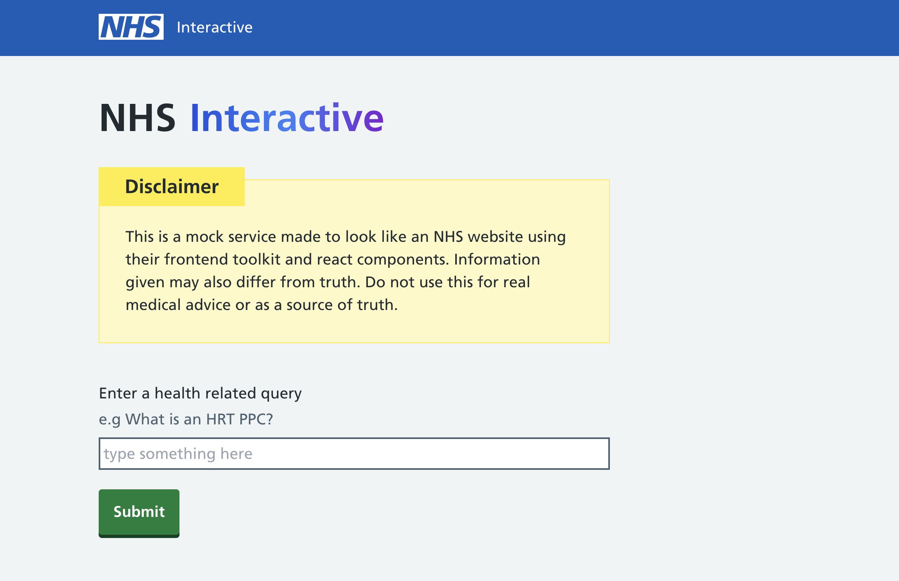

# nhs-interactive



A ChatGPT POC built within the NHS Front-end toolkit and React components.

## Run the app

Clone the repo.
Install the project dependencies:

```bash
npm i
```

Run the app:

```bash
npm run dev
```

Run tests:

```bash
npm run test
```

Optional DB integration

You can run the pocketbase executable from the root dir.

```bash
./pocketbase serve
```

## Configuration

File: `.env.{environment}`

Options:

```bash
OPENAI_API_KEY: string;
DB_STORE: boolean;
DB_URL: string;
```
